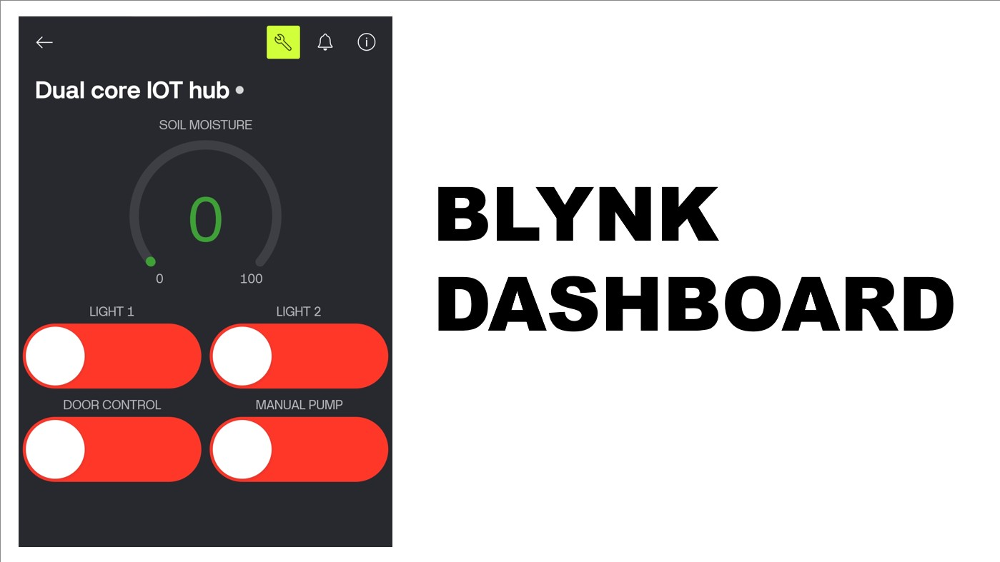

# 🏠 Dual-Core IoT Hub: Smart Home & Precision Irrigation System

**Experience the future of home automation with a high-performance ecosystem that bridges Google Assistant voice intelligence and Blynk IoT mobility with industrial-grade hardware execution.** This project utilizes a dual-core architecture—an **ESP8266** for seamless cloud orchestration and an **Arduino Uno** for precision control over motorized hinges, solenoid security, and intelligent irrigation.

## 🏠 System Architecture
The system operates on a specialized **Master-Slave Serial Protocol** via UART at 9600 Baud:
1. **Master (ESP8266 12E):** Cloud Gateway managing **Blynk IoT**, **Sinric Pro**, and **Google Home Automation** (via **Google Assistant**).
2. **Slave (Arduino Uno):** Hardware Executor managing the **Servo**, **Solenoid**, **Pump**, and **Soil Sensor**.

---

## 🚀 Project Summary
This hub integrates three major cloud ecosystems to provide a seamless user experience:
* **Blynk IoT:** Provides a custom mobile dashboard with a real-time moisture gauge and manual override switches for total control from anywhere.
* **Sinric Pro:** Acts as the bridge for professional smart home device emulation, making your DIY hardware look like official smart appliances.
* **Google Home & Assistant:** Enables hands-free voice commands such as *"Hey Google, open the door"* or *"Turn on the garden lights,"* allowing for full **Google Home Automation** routines and ecosystem-wide accessibility.

---

## 🔐 Configuration & Security
To maintain security, all sensitive credentials must be entered directly into the source code files. **Do not share the following values publicly.**

### ESP8266 Configuration Requirements:
* **WiFi:** SSID and Password for local network access.
* **Blynk:** Template ID, Template Name, and Auth Token.
* **Sinric Pro:** App Key, App Secret, and unique Device IDs.

---

## 🔌 Circuit Connections

### 1. The Serial Bridge (UART)
A **Voltage Divider** (10kΩ/20kΩ) is required on the Arduino's TX line to protect the ESP8266's 3.3V logic.
* **Arduino TX (Pin 1)** ⮕ `10kΩ Resistor` ⮕ **ESP8266 RX**
* **ESP8266 RX** ⮕ `20kΩ Resistor` ⮕ **GND**
* **ESP8266 TX** ⮕ **Arduino RX (Pin 0)**

### 2. Arduino (Hardware Slave) Pin Mapping
| Component | Arduino Pin | Function |
| :--- | :--- | :--- |
| **Status LED** | D11 (PWM) | Fade/Flicker System Indicator |
| **Relay 1 & 2** | D2, D3 | Light 1 & Light 2 Control |
| **Relay 3** | D4 | 12V Solenoid Security Lock |
| **Relay 4** | D5 | 5V Water Pump Control |
| **Servo Signal** | D9 | Door Hinge PWM Control |
| **Door LED** | D6 | Synchronized Entry Light |
| **Buttons 1, 2, 3** | D7, D8, D12 | Manual Overrides (Lights & Door) |
| **Soil VCC / SIG** | D13 / A0 | Anti-Corrosion Power & Signal |

---

## 📸 Product Gallery

### **Final Hardware Assembly**

*Connections.*

### **Flow Chart**

*Flow-Chart for Connections.*

### **Blynk IoT Dashboard**

*Physical Connections*

---

## 🎥 Demo Video

*Click the image above to play the system demonstration on YouTube.*

---

## 🚀 Features & Logic
* **Anti-Corrosion Irrigation:** Soil moisture sensor is powered by **Pin 13** only every 10 seconds to prevent probe electrolysis.
* **Spring-Latch Logic:** Solenoid retracts only during the "Open" phase. During "Close," the servo swings the door back to click shut mechanically.
* **Bi-directional Sync:** Manual button presses on the Arduino update the cloud UI in real-time across Blynk and Google Home.

---

## 📂 Final Codes 
The complete firmware for both the Master (ESP8266) and Slave (Arduino Uno) units can be found here:
* [**📂 Source Codes**](codes)

---

## 🤝 Social Connect 
**Developed by ASIF**

