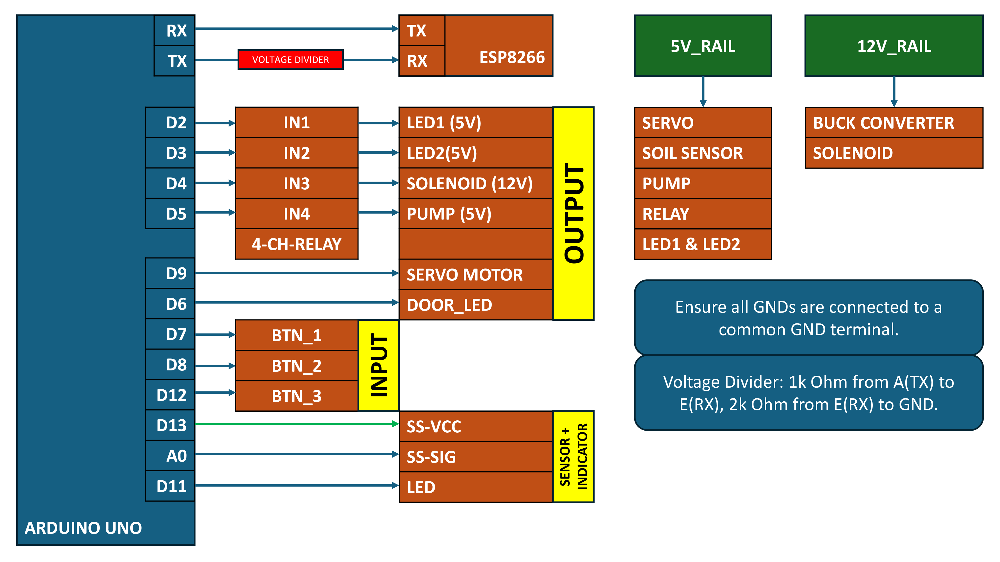

# 🏠 Dual-Core IoT Hub: Smart Home & Precision Irrigation System

**Experience the future of home automation with a high-performance ecosystem that bridges Google Assistant voice intelligence and Blynk IoT mobility with industrial-grade hardware execution.** This project utilizes a dual-core architecture—an **ESP8266** for seamless cloud orchestration and an **Arduino Uno** for precision control.

## 🚀 Project Summary
* **Blynk IoT:** Custom mobile dashboard with real-time moisture gauge (V5).
* **Sinric Pro:** Professional smart device emulation for Light 1, 2, and Door.
* **Google Home & Assistant:** Voice-controlled automation routines.

---

## 🔌 Circuit Connections & Pin Mapping
### 1. The Serial Bridge (UART)
Requires a **Voltage Divider** (10kΩ/20kΩ) on the Arduino's TX line.
* **Arduino TX (Pin 1)** ⮕ `10kΩ Resistor` ⮕ **ESP8266 RX**
* **ESP8266 RX** ⮕ `20kΩ Resistor` ⮕ **GND**

### 2. Arduino Pin Layout
| Component | Pin | Function |
| :--- | :--- | :--- |
| **Relay 1, 2, 3, 4** | D2, D3, D4, D5 | Light 1, Light 2, Solenoid, Pump |
| **Servo / Door LED** | D9 / D6 | Hinge Control & Entry Light |
| **Buttons 1, 2, 3** | D7, D8, D12 | Manual Cloud Sync Overrides |
| **Soil VCC / SIG** | D13 / A0 | 10s Anti-Corrosion Power Logic |

---

## 📸 Product Gallery

*Flow-Chart for Connections.*

*Physical Connections & Blynk Layout.*

---

## 🎥 Demo Video

*Click to play the system demonstration on YouTube.*

---

## 🚀 Features & Logic
* **Anti-Corrosion Irrigation:** Soil moisture sensor is powered by **Pin 13** only every 10 seconds to prevent probe electrolysis.
* **Spring-Latch Logic:** Solenoid retracts only during the "Open" phase. During "Close," the servo swings the door back to click shut mechanically.
* **Bi-directional Sync:** Manual button presses on the Arduino update the cloud UI in real-time across Blynk and Google Home.

---

## 🐞 Troubleshooting & Debug Report
To ensure system stability, use the following isolation guide if issues arise:

| Bug ID | Component | Symptom | Resolution |
| :--- | :--- | :--- | :--- |
| **001** | **UART Link** | No data on Blynk app | Swap TX/RX; Verify Common GND between boards. |
| **002** | **Solenoid** | ESP8266 resets on trigger | Install 1N4007 Flyback Diode to stop EMF spikes. |
| **003** | **Soil Sensor** | Reading is 0 or 1023 | Increase `delay(20)` after Pin 13 goes HIGH. |
| **004** | **Servo** | Jittering / Vibrating | Ensure 5V Buck Converter provides at least 2A. |

**Debug Tip:** Use the Arduino Serial Monitor (9600 Baud). If you see `BTN_PRESS` locally but not on the App, the hardware is fine—check your Cloud API keys.

---

## 📂 Final Codes 
* [**📂 Click here to view Project Source Codes on GitHub**](https://github.com/YourUsername/YourRepoName/tree/main/codes)

---

## 🤝 Social Connect
**Developed by ASIF**

